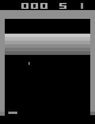
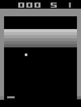
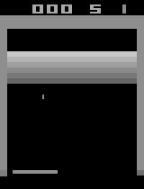
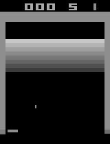

# Breakout-env

A [gym](https://github.com/openai/gym/blob/master/gym/envs/atari/atari_env.py) like Breakout environment but with more configurable options.






## Configure Options

| Option          | Description                                                          | Type          | Range      | Default Value                    |
|-----------------|----------------------------------------------------------------------|---------------|------------|----------------------------------|
| `max_step`      | Max step per episode.                                                | `int`         | 0 ~ Inf    | `10000`                          |
| `lifes`         | Lifes.                                                               | `int`         | 0 ~ 9      | `5`                              |
| `ball_speed`    | Ball's initial velocity. [y, x]                                      | `[int, int]`  | -Inf ~ Inf | `[-5, 2]`                        |
| `ball_color`    | Ball's color. (gray scale)                                           | `int`         | 0 ~ 255    | `143`                            |
| `ball_size`     | Ball's size. [h, w]                                                  | `[int, int]`  | 1 ~ Inf    | `[5, 2]`                         |
| `paddle_width`  | Paddle's width.                                                      | `int`         | 1 ~ 100    | `15`                             |
| `paddle_color`  | Paddle's color. (gray scale)                                         | `int`         | 0 ~ 255    | `143`                            |
| `paddle_speed`  | Paddle's moving speed.                                               | `int`         | 1 ~ Inf    | `2`                              |
| `bricks_rows`   | Number of bricks row.                                                | `int`         | 0 ~ Inf    | `6`                              |
| `bricks_color`  | Row color of bricks. `len(bricks_color)` should equal `bricks_rows`  | list of `int` | 0 ~ 255    | `[200, 180, 160, 140, 120, 100]` |
| `bricks_reward` | The reward of bricks. `len(bricks_color)` should equal `bricks_rows` | list of `int` | -Inf ~ Inf | `[6, 5, 4, 3, 2, 1]`             |

## Example

### Play with random action

```py
from breakout_env import Breakout

env = Breakout({
    'lifes': 7,
    'paddle_width': 30,
    'paddle_speed': 5
  })

for ep in range(2):
  obs = env.reset()
  while True:
    # Select random action
    action = random.randint(0, env.actions - 1)
    obs, reward, done, _ = env.step(action)
    print('Episode: {}, Reward: {}, Done: {}'.format(ep, reward, done))
    if done:
      break
```

### Visualize the game

The observation retuned by env is a numpy 2D array, it can be easily visualize using some libaray like [OpenCV]() or [matplotlib]().

```py
import cv2
from breakout_env import Breakout

env = Breakout()
env.reset()

while True:
  # Select random action
  action = random.randint(0, env.actions - 1)
  obs, reward, done, _ = env.step(action)
  # Show the observation using OpenCV
  cv2.imshow('obs', obs)
  cv2.waitKey(1)
  if done:
    break
```

## Requirement

- python3
- numpy

## Reference

- [OpenAI Gym](https://github.com/openai/gym/blob/master/gym/envs/atari/atari_env.py)
- [ALE interface - Breakout](https://github.com/openai/atari-py/blob/master/atari_py/ale_interface/src/games/supported/Breakout.cpp)
- [BreakoutNoFrameskip-v4 video](https://youtu.be/o72FS5eqPNs)